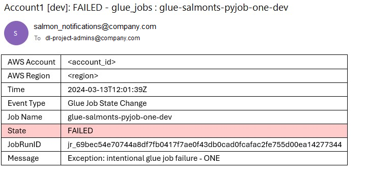
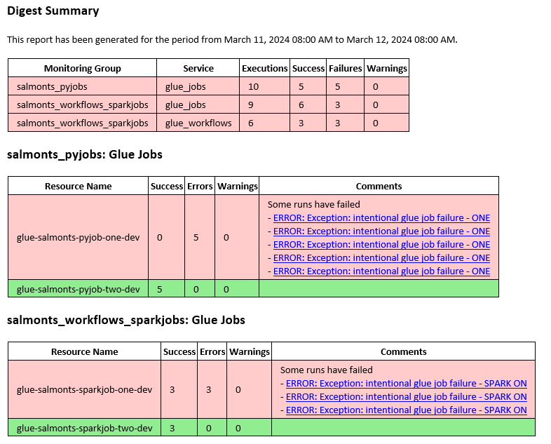

# Soname ALerts and MONitoring (SALMON)

[](https://github.com/Soname-Solutions/salmon/actions/workflows/unit_tests.yml)
[](https://github.com/Soname-Solutions/salmon/actions/workflows/integration_tests_full.yml)
[](https://github.com/Soname-Solutions/salmon/actions/workflows/cdk_deployment_tests.yml)

- [Soname ALerts and MONitoring (SALMON)](#soname-alerts-and-monitoring-salmon)
  - [What is this project for?](#what-is-this-project-for)
  - [SALMON Key Features](#salmon-key-features)
  - [How SALMON works?](#how-salmon-works)
  - [Monitored services in scope](#monitored-services-in-scope)
  - [How to start](#how-to-start)
  - [Contributing](#contributing)
      - [Before You Submit a Pull Request:](#before-you-submit-a-pull-request)
  - [Tests coverage](#tests-coverage)
  - [Other useful links](#other-useful-links)


## What is this project for?

We develop SALMON to be your go-to solution for monitoring AWS-based data pipelines.  
It's designed to be simple to use, deploy, and maintain.  
SALMON's is focusing on AWS services commonly utilized in data processing, like Glue, Step Functions, EMR, Lambda, and more.  
It can suit the need of a small team (you don't have to spend time developing your own monitoring solutions) or a large enterprise (when you need to observe vast array of pipelines and resources).

## SALMON Key Features

- **Immediate Alerts**: Get instant notifications for pipeline failures, like a glitch in your Glue Job.\
\
    

- **SLA Monitoring**: Track execution times, like Step Function durations, and spot when it exceeds the predefined threshold.
- **Daily Digests**: Receive a comprehensive daily email summarizing your pipeline's health – perfect for a quick status check.\
\
    

- **Team-Specific Notifications**: Operating with multiple teams or domains? Configure SALMON to logically group pipelines and resource, so it can send notifications to relevant recipients only.
- **Statistics at Your Fingertips**: Gather detailed execution stats and access them through user-friendly dashboards.\
\
    
    

- **Cross-Account and Region Support**: Monitor pipelines across various AWS accounts and regions in one central place.

## How SALMON works?

SALMON's core part is a centralized ("tooling") environment which collects, stores and processes alerts and execution statistics of your data pipelines (even if they are scattered across multiple AWS accounts and regions).

For each AWS account and region where your pipelines are deployed (in SALMON's terminology it's a "monitored" environment), SALMON requires small portion of resources (EventBridge rule to send alerts to centralized environment and minimal permissions IAM Role, so SALMON can collect pipeline metrics).

With that setup:
1. **Alert Handling**: Alerts, such as those for Step Function failures, are generated in the monitored account and sent through the EventBridge bus to the centralized location. There, alert information is parsed, formatted, and sent to the relevant recipients, be it individual emails, distribution lists, Slack channels, etc.
2. **Metrics Collection**: Metrics data (from all monitored accounts and regions) is extracted periodically (by default, once every 5 minutes) and stored in a Timestream database.
3. **Accessing Metrics Data**: You can access this data using SALMON's [Grafana](docs/grafana.md) instance (optional) or by connecting a tool of your choice to the metrics database.  
Additionally, you can configure a daily digest to be sent out based on this metrics data.


For more details please refer to [Solution architecture description](docs/architecture.md)

## Monitored services in scope

| AWS Service | Alerts | Metrics |
|:---|:---:|:---:|
| AWS Glue Jobs | Immediately on Failure | Job Executions stats <br/> (Duration, State, DPU-Hours consumed, etc.) |
| AWS Glue Data Quality | Immediately on Failure | Ruleset Executions stats <br/> (Duration, Score, Number of Rules failed/succeeded, etc.) |
| AWS Glue Workflows | With a small delay <br/> (as a part of metrics collection process) | Workflow Executions stats <br/> (Duration, State, etc.) |
| AWS Glue Crawlers | Immediately on Failure | Crawler Executions stats <br/> (Duration, State, DPU-Hours consumed, etc.) |
| AWS Glue Data Catalogs | Immediately on Failure | Number of Objects (Tables, Patitions, Indexes) in the Data Catalog |
| AWS Step Functions | Immediately on Failure | State Machine Execution stats (Duration, State, etc.) |
| AWS Lambda Functions | With a small delay <br/> (as a part of metrics collection process) | Execution stats <br/> (Duration, Billed duration, Memory usage, etc.) |
| Amazon EMR Serverless | Immediately on Failure | Execution stats (Duration, State, Billed vCPU, Memory, Storage, etc.) of Job submitted to the EMR application  |

## How to start

1. **Take a Look at Key Concepts**: Begin by checking out our [Key Concepts](docs/key_concepts.md) document. It’s a quick read that’ll give you a solid understanding of SALMON's core aspects, setting you up for easy configuration and deployment.
2. **Identify Your Pipelines for Monitoring**: Think about the pipelines in your system that you need to keep an eye on. SALMON lets you logically group these pipelines and resources (like grouping them by the responsible team) and assign the right recipients for each group’s alerts.
3. **Prepare Your Configuration**: Based on what you outlined in Step 2, set up your SALMON configuration. Our [Configuration guide](docs/configuration.md) will walk you through the process.  
You’ll be defining your environments (both tooling and monitored), monitoring groups, and recipient lists.
4. **Deploy SALMON**: Deploy SALMON resources in Tooling Environment and, then, in Monitored Environments: [Deployment and installation](docs/deployment.md). SALMON uses configuration you prepared in Step #3 during deployment and its day-to-day work.

You are all set!

## Contributing

Looking to contribute to SALMON? We’d love your help in making this project even better. Here’s how you can get involved:

1. **Report Bugs**: Found something that’s not working right? Open an issue and let us know. 
2. **Share Your Ideas**: Have thoughts on new functionalities or AWS Services that SALMON should cover?
3. **Contribute Code**: If you’ve got something great to add, create a pull request. Your contributions can make a big difference.

Note: Before submitting your Pull Request please make sure Black formatter rules are applied to the code. Those are prerequisites for automatic formatting:
1. Install pre-commit (it's installed alongside with other dependencies when running `pip install -r requirements.txt`).
2. Run `pre-commit install` afterwards.
3. Make sure you have `.pre-commit-config.yaml` file (it is already a part of repository).

If you're interested in contributing to our project by adding a new AWS service, please refer to our guide: [Steps to Integrate New AWS Service](docs/adding_aws_service_integration.md).

#### Before You Submit a Pull Request:
To make things easy and keep our codebase clean, we use Black for code formatting. Here are steps to set it up:
1. Install the required packages (including pre-commit) by running:
```bash
pip install -r requirements.txt
```
2. Install the pre-commit hooks to automatically format your code before each commit:
```bash
pre-commit install
```
3. You're All Set: The `.pre-commit-config.yaml` file is already in the repository, so you don't need to do anything else. 

🤗 **Thank you for contributing!** Together, we can make SALMON better for everyone.

## Tests coverage

SALMON project has the following types of automated tests developed:
- Unit Tests
- Integration Tests
- Deployment Tests

If you plan to contribute to the project, please refer to [tests overview article](/docs/testing_approach.md) and run the aforementioned tests to verify your Pull Request.

## Other useful links

* [FAQ & Troubleshooting](docs/faq.md)
* [Version history](docs/changelog.md)