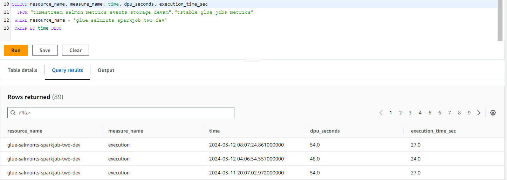

# SALMON architecture overview

*Note: This article uses Salmon-specific terminology which is defined in a short document here: [Key Concepts](/docs/key_concepts.md).*

## Detailed architecture diagram

Note: If you interested in more high-level view, conceptual diagram is presented in main [README.md](/README.md)

### Tooling Environment - Common Components

This section covers cross-cut platform components.

**Settings Service**

Settings Service is a Python library which provides an interface for all solution's components to interact with SALMON's configuration.  
E.g. getting list and content of monitoring group, checking which recipients should be notified about a specific Glue Job failure etc.

For more information on Settings - please refer to [Configuration Guide](/docs/configuration.md).

**Notification Service**

Notification Service is responsible for sending messages to recipients (where they are e-mails, Slack channels etc.).  
Components, such as Alerting Lambda and Digest lambda prepare messages and send those to SQS queue alongside with
recipients information.  
Notification Lambda polls SQS and for each message received converts it to either HTML or markdown (depending on recipient's delivery method) and
sends to relevant recipient.

**Metrics Data Storage**

This is an AWS Timestream database (serverless) where the following artifacts are stored:
- Data pipeline metrics, stored in one table per each service. Typically, you see one row containing all metrics for a certain execution (e.g. Glue Job run)
- Alert events.

You can query this data via AWS Console or connecting to Timestream DB in any other way:  

Alternative option is to use an optional Grafana instance which connects to this database and provides a set of default ready-to-go dashboards.

Default metrics retention period (1 year) can be changed in configuration file.

**CloudWatch storage for event**

A separate CloudWatch Log Group is created to store events collected from monitored environments.  
Alerting Lambda populates this log while processing an event. Log records is created for successful and failed executions.  

### Tooling Environment - Alerting Functionality

This set of components for handling and parsing events coming from Monitored environments, defining relevant recipients for the event and, finally, delivering notifications via Notification Service.  
When event is parsed, it's also formatted, so you don't just get plain JSON from EventBridge event, but a readable message.

Events are not limited to failures (e.g. Glue Job failure), but SALMON also handles successful executions (so, for example, you can get information when you Step Function completed successfully).

Components:
- Custom EventBridge EventBus, which is the a destination for all notifications from monitored environments.
- Alerting Lambda (a destination for aforementioned EventBus) which encapsulates all event processing.

Processed events are not only delivered to recipients (e.g. in a form of e-mail), but also stored in Timestream database.

### Tooling Environment - Monitoring Functionality

Functionality covered by this part of solution:
- Extracting metrics data from Monitored Environments and storing those into Timestream DB (implemented as a set of Lambda functions)
- Preparing and sending a *daily digest e-mail* (Digest Lambda via Notification Service).  
- (optional) Grafana Dashboards for Execution Metrics and Alerting events. Grafana (if you switch it on in configuration) is deployed inside an EC2 instance from an AMI Image "Bitnami package for Grafana" (as a cost-effective way).

### Tooling Environment - Internal Errors Handling

This group of resources are responsible for notifying SALMON's administrators in an unlikely event of internal component's failure.  
It comprises SNS Topic where all internal errors are sent to which administrators should subscribe to.
All SALMON's lambda functions in case of failure send failure information to SNS.

### Monitored Environment(s)

Deployed for each AWS account and region where you data pipeline resources to monitor.
Monitored environment resources include:
- EventBridge rule to send relevant AWS events into centralized EventBus in Tooling Environment.
- IAM Role with minimal permitting Extract Metrics Lambdas to get the information required.
