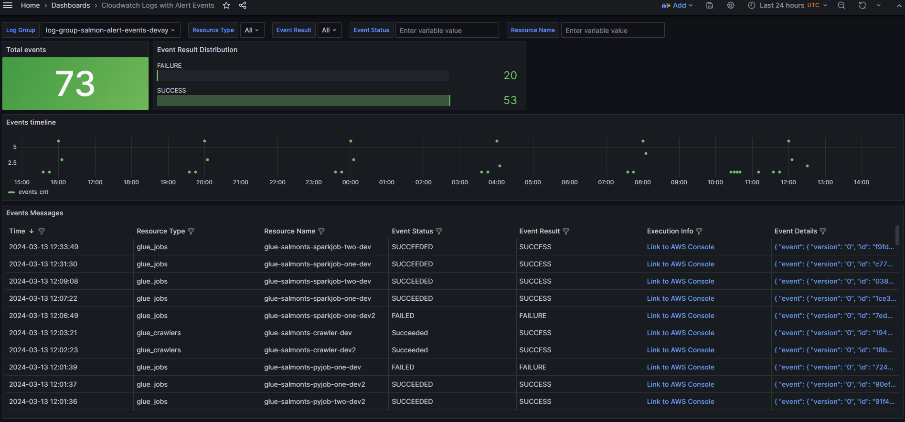

# SALMON Dashboards

- [SALMON Dashboards](#salmon-dashboards)
  - [Overview ](#overview-)
    - [Sign in to Grafana ](#sign-in-to-grafana-)
    - [Managing Users and Dashboards ](#managing-users-and-dashboards-)
  - [Dashboards](#dashboards)
    - [Visualizing CloudWatch Alerts ](#visualizing-cloudwatch-alerts-)
    - [Visualizing Timestream Metrics ](#visualizing-timestream-metrics-)

##  Overview 

Salmon collects and stores events and data pipeline metrics in AWS TimeStream database and CloudWatch logs.  
In order to visualize this data and create your own dashboards, your can either use a tool of your choice or
opt for **optional** Salmon's Grafana component with pre-built dashboards.

In latter case, Grafana is deployed using the Bitnami Grafana image from AWS Marketplace on Amazon EC2: \
\
     

How to switch Grafana component on: in **general.json** config file, add *"grafana_instance"* section (for more details please refer to our [Configuration guide](/docs/configuration.md) for more details on the Grafana configuration).

### Sign in to Grafana 

To sign in to Grafana, follow these steps:
1. In AWS Console, browse to AWS CloudFormation stack `cf-salmon-InfraMainStack-<<stage-name>>`
2. Stack's output contains:
   1. IP address of Grafana instance
   2. AWS Secret containing initial credentials for Grafana Admin user
3. Open your web browser and go to the URL specified in the output `GrafanaURL`.
    >  You can also navigate to the EC2 instance named as `ec2-salmon-grafana-instance-<<stage-name>>` to check the public IP and access Grafana via `http://<grafana-instance-public-ip>:3000`. 
4. On the signin page, enter username and password from the corresponding secret `secret-salmon-grafana-password-<<stage-name>>` created in AWS Secrets Manager.
5. Click Sign in.

###  Managing Users and Dashboards 
After logged in, under "Dashboards", you will find the default dashboards within a dedicated folder named "Default SALMON Dashboards": \
\
     

 These dashboards include:
 - **CloudWatch Logs Dashboard with Alert Events**: This dashboard provides insights into CloudWatch logs with alert events.
 - **Timestream Metrics Dashboard**: This dashboard is based on the Timestream table with Metrics and implemented for each Resource type (Glue Jobs, Glue Workflows, Lambda Functions, Step Functions in the version 1.0).

Grafana dashboards can be exported and imported as `JSON`. You can find SALMON dashboard templates [here](../infra_tooling_account/infra_tooling_account/grafana).

The Grafana Admin can also create additional users and assign necessary permissions. Moreover, these pre-provisioned dashboards are customizable to meet specific customer requirements. Adjustments can be made and saved, and the dashboards can be easily re-created through the export and import of the required JSON dashboard model. 

## Dashboards
To help you get started with data visualization, we created the following dashboards in Grafana. 
### Visualizing CloudWatch Alerts 
The following CloudWatch dashboard visualizes Alerts from the dedicated CloudWatch log group: \
\
    

Dashboard features:
- **Filtering Options**: Users can filter data by Resource type, Event Result, Event Status, and Resource name to focus on specific metrics and resources.
- **Execution Information**: The dashboards include an `Execution Info` column providing links to specific resource runs or log group (as for Lambda functions) in AWS Console.
- **Time Range**: By default, the dashboards display data for the last 24 hours in Coordinated Universal Time (UTC), but users have the flexibility to adjust the time range as needed. 
- **Event Inspection**: `Event Details` can be inspected in JSON format for detailed examination of each event: \
\
    

### Visualizing Timestream Metrics 
The following Timestream dashboard visualizes the metrics from the corresponding Timestream table: \
\
     

Dashboard features:
- **Filtering Options**: Users can filter data based on Measure Name, Monitored Environment, and Resource name to focus on specific metrics and resources.
- **Time Range**: Similar to the CloudWatch dashboard, the default time range for Timestream dashboards is the last 24 hours in UTC, but users can adjust it according to their requirements.
- **Resource-specific Metrics**: Similar dashboards are created for Glue Jobs, Glue Workflows, Lambda Functions, and Step Functions, each tailored to showcase the corresponding metrics.